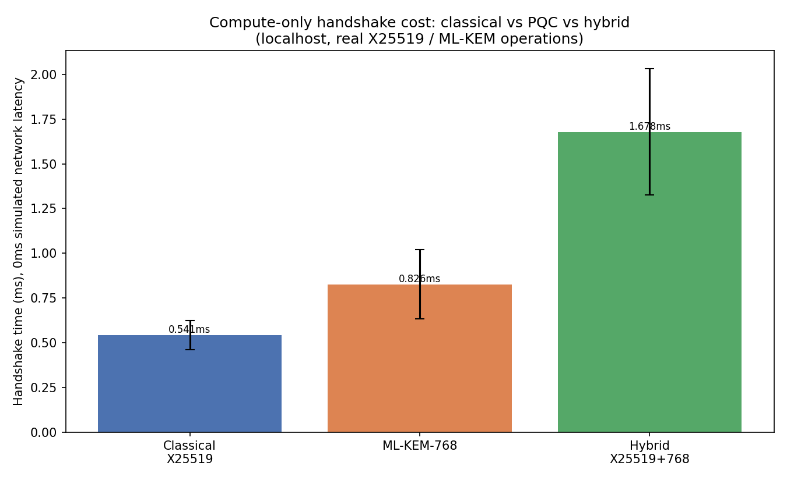
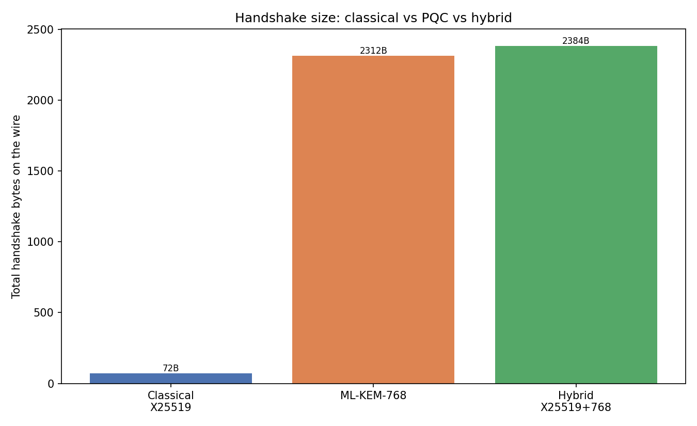
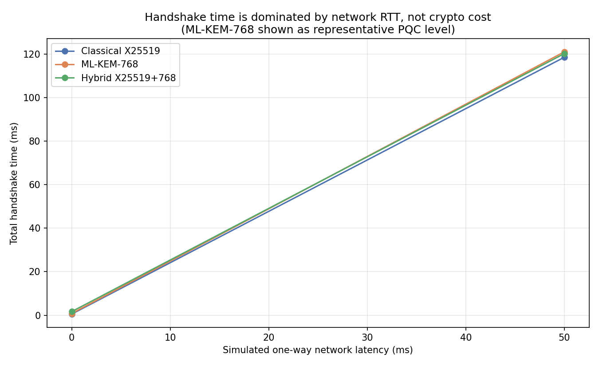

# PQC Migration Benchmark: Classical vs Post-Quantum vs Hybrid Key Exchange

A hands on learning experience developing benchmarks comparing **classical ECDH (X25519)**, **post-quantum
ML-KEM (FIPS 203 / Kyber)**, and **hybrid X25519+ML-KEM** key exchange
that run as handshakes over TCP sockets, using [liboqs](https://github.com/open-quantum-safe/liboqs)
and Python's `cryptography` library.

## Why this matters

Recently, NIST finalized the first post-quantum cryptography standards
(FIPS 203/204/205). With that the urgency is a product of upcoming phenomoemnom
called **"harvest now, decrypt later"**: an adversary can record encrypted
traffic today and decrypt it retroactively once a cryptographically-relevant
quantum computer exists. For data with a long confidentiality shelf life i.e.
medical records, state secrets, infrastructure credentials, that threat is
already live, regardless of when the quantum computer actually arrives.

As such, organizations are migrating key exchange to **hybrid** schemes (classical + PQC
combined) as they are the default for the transition. You need
both primitives broken to lose confidentiality. Chrome/BoringSSL and
OpenSSH already ship hybrid X25519+ML-KEM by default for exactly this
reason.

What I am trying to think about and explore was what does that migration
actually cost you, in handshake latency and bytes on the wire?

This benchmark was built after reading Rios et al., "[Toward the Quantum-Safe Web: Benchmarking Post-Quantum TLS](https://ieeexplore.ieee.org/stamp/stamp.jsp?arnumber=10844321)" (IEEE Network, 2025),
which benchmarks full TLS 1.3 handshakes across NIST PQC standards using
OpenSSL/liboqs/oqs-provider in Docker. This paper measures connections-per-second and transmission overhead across
KEM + signature combinations at all five NIST security levels.

## What's actually being measured

This isn't a full TLS 1.3 implementation just a
2-message handshake protocol (server sends its key material, client
responds with its own) built directly on `oqs` (ML-KEM bindings) and
`cryptography` (X25519), so the comparison isolates the key-exchange
primitive itself rather than being buried inside a full TLS stack.

Three modes, same wire shape (1 round trip each):

| Mode          | Server → Client               | Client → Server                   | Derived key                    |
| ------------- | ----------------------------- | --------------------------------- | ------------------------------ |
| **classical** | X25519 pubkey                 | X25519 pubkey                     | HKDF(ECDH shared secret)       |
| **pqc**       | ML-KEM pubkey                 | ML-KEM ciphertext                 | HKDF(KEM shared secret)        |
| **hybrid**    | X25519 pubkey ‖ ML-KEM pubkey | X25519 pubkey ‖ ML-KEM ciphertext | HKDF(ECDH secret ‖ KEM secret) |

Every handshake:

1. Spins up a real TCP server thread on `127.0.0.1`
2. Connects a real client socket to it
3. Runs the handshake, timing wall-clock from the client's first byte sent
   to deriving its final key
4. **Asserts both sides derived an identical session key** (this is the
   correctness check — if it doesn't match, the run fails loudly)
5. Records handshake time and total wire bytes

To separate "crypto compute cost" from "network cost," the harness also
wraps every socket in a `DelayedSocket` that injects configurable
one-way latency (0 / 20 / 75 ms), simulating localhost, same-region, and
cross-region-ish network conditions on top of the real crypto operations.

## Results

All charts and raw data are in `results/`. 60 trials per configuration,
21 configurations, 1,260 total handshakes — all with verified matching
keys.

### 1. Compute cost is not where the overhead is



At 0ms simulated network latency, classical X25519 averages **~0.32ms**.
Pure ML-KEM is actually faster than classical at every security level (~0.18–0.20ms) — ML-KEM's
lattice operations are cheap. Hybrid mode, doing both, lands at
**~0.37–0.44ms**.

### 2. The real cost is on the wire



Classical X25519 is **72 bytes** round-trip. ML-KEM-768 alone is **2,280 bytes**, about
**32x larger**. Hybrid X25519+ML-KEM-768 is **2,352 bytes** (about the
sum of both, as expected). ML-KEM-1024 has hybrid mode at **3,216 bytes**,
a ~45x increase over classical alone.

### 3. Network latency dominates everything



Once you add realistic network latency, the crypto and byte-size
differences between all three modes become nearly invisible. At 75ms
all land within **~0.3ms of each other** (~150.8ms total). The 32-45x increase in payload
size doesn't translate into a proportional latency increase because a few
extra kilobytes is nothing compared to a single network round trip on
any connection that isn't already saturated.

## So what does this mean for a real migration decision?

- **On typical internet-facing services**, the byte overhead of hybrid PQC
  key exchange is very unlikely to be the bottleneck. Network RTT and TLS
  record processing overhead will dwarf it. This matches what Cloudflare
  and Google have reported from real-world hybrid PQC rollout at scale.
- **Hybrid, not pure-PQC, is the right default** for the transition —
  the cost delta between pure-ML-KEM and hybrid is small (this benchmark
  shows +50-150 bytes and +0.05-0.2ms), and hybrid is what's actually
  shipping in production (Chrome, BoringSSL, OpenSSH).

## Project structure

```
pqc-migration-bench/
├── src/
│   ├── common.py              # wire framing + HKDF helpers
│   ├── handshake_classical.py # X25519 handshake
│   ├── handshake_pqc.py       # ML-KEM handshake
│   ├── handshake_hybrid.py    # X25519 + ML-KEM combined handshake
│   ├── netsim.py              # artificial network latency injection
│   ├── bench.py                # orchestrates the full sweep, writes CSV
│   ├── analyze.py             # generates charts + summary.csv
│   └── test_handshakes.py     # correctness tests (key agreement, tamper-safety checks)
├── results/
│   ├── handshake_results.csv  # raw per-trial data (1,260 rows)
│   ├── summary.csv            # aggregated mean/stdev per configuration
│   ├── latency_overhead.png
│   ├── wire_bytes.png
│   └── latency_vs_network.png
└── README.md
```

## Limitations / what I'd do next

- This is a key-exchange microbenchmark, not a full TLS 1.3
  implementation as there occurs no certificates, no record layer, no cipher suite
  negotiation. While that does allow for isolation of variables under test,
  it means these numbers aren't a substitute for benchmarking an
  actual PQC-enabled OpenSSL/BoringSSL.
- All trials ran on localhost with _simulated_ latency (sleep-based) not accounting
  for packet loss or other effects.
- Next step I'd want to add: (1) a real TLS 1.3 handshake using OpenSSL's
  PQC provider for an apples-to-apples comparison against this
  minimal-protocol version, and (2) PQC digital signatures (ML-DSA) for
  the certificate/authentication side, which is a separate migration
  problem with its own size/performance tradeoffs.
